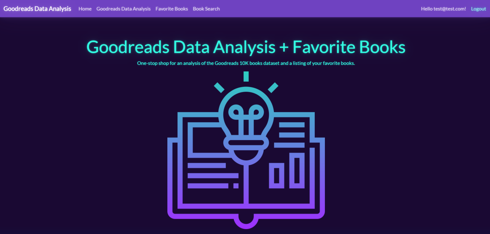
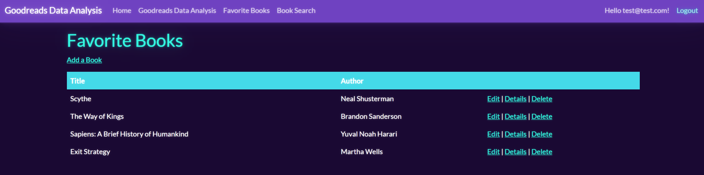

# Project - Goodreads Data Analysis + Favorite Books

### Simple ASP.NET web application to accomplish 2 objectives:
1. Using Python Pandas library to perform data analysis and visualization on an open source [Goodreads 10K book dataset](https://github.com/zygmuntz/goodbooks-10k) (CSV flat flies)
2. From user input, allow the reading, creation, updating, and deleting of a listing of favorite books 

### Tech Stack:
* C# (.NET 6.0)
* ASP.NET Core MVC Framework
* Entity Framework Core 6 (EF6 Core) ORM
    * Objective 1 uses a **database-first** approach after manually importing the csv files via the SQL Server Import Flat File GUI wizard
        * Reversed-engineered for EF6 Core with this scaffolding command: `Scaffold-DbContext "[INSERT CONNECTION STRING HERE]" Microsoft.EntityFrameworkCore.SqlServer -OutputDir Models -Tables GoodreadsBooks,GoodreadsBookToTags,GoodreadsTagsMapping,GoodreadsUserBookRatings,GoodreadsUserBooksToRead`
    * Objective 2 uses a **code-first** approach with the creation of a FavoriteBooks model and adding migrations for any database changes via code
* SQL Server DB
* Bootstrap 5
* Python 3.9
* Python Pandas Data Analysis library

### Work in Progress:

